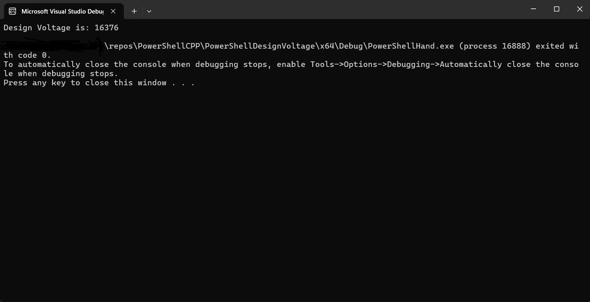
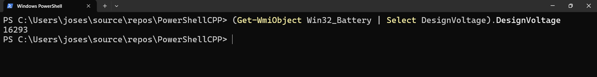
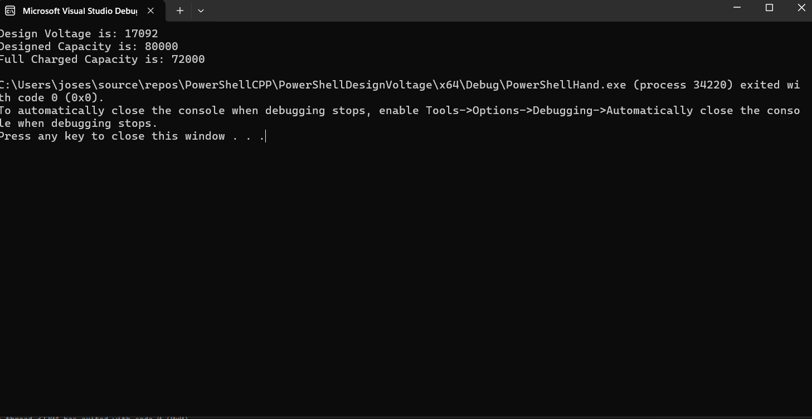

# PowerShell C++ Design Voltage Fetcher

This console application retrieves the Design Voltage from a single battery in a computer. This program is written in C++, and it interfaces with C++ to obtain the result from PowerShell. The PowerShell Command is 
```PowerShell
Get-WmiObject Win32_Battery | Select DesignVoltage).DesignVoltage
```
In lieu of this I plan to play around with this and see what other things I can do with this knowledge.

This is the C++ Output.



This is the PowerShell Output.



# Latest Integration FullChargedCapacity and DesignedCapacity Fetcher
## 2025-05-16

In this latest version I have created a function in C++ that facilites the PowerShell commands output and returns the string of the results.



# Future Work

I do see the differences and will in future commits see why there differences.

## Updated 2025-05-16

- Be able to support two batteries.
- Be able to support Linux.
- Deploy onto another PC and validate it works.

## Acknowledgements

 - Professors at Kean University
 - Professors at NJIT
 - Research Mentors at Kean University
 - StackOverflow Q&A Discussion
 - ChatGPT
 - ClaudeAI


## Authors

- [@FPyC639](https://github.com/FPyC639)


## Appendix

[](https://www.buymeacoffee.com/joseserra8x)
